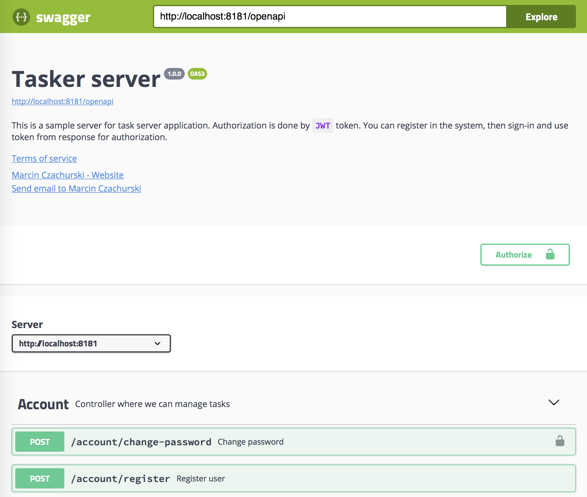
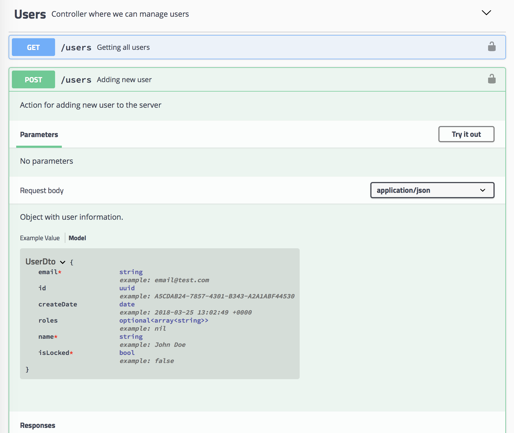
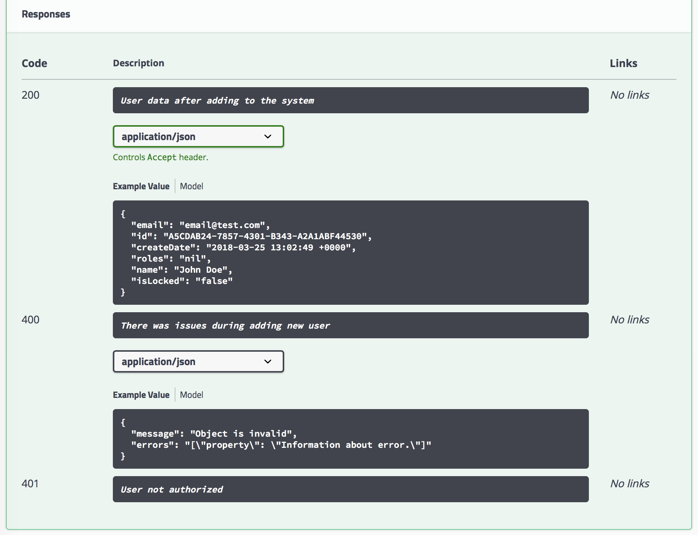

# Swiftgger


[](ttps://developer.apple.com/swift/)
[](https://swift.org/package-manager/)
[](https://developer.apple.com/swift/)

Swiftgger is a Swift library which can generate output compatible with [OpenAPI version 3.0.1](https://github.com/OAI/OpenAPI-Specification/blob/master/versions/3.0.1.md). You can describe your API using Swiftgger classes and expose OpenAPI definition by endpoint in your API. URL to that endpoint can be used in [Swagger UI](https://swagger.io/swagger-ui/).



Also you can user Swiftgger to generate Swift files based on OpenAPI definition file. Example usage:

```swift
$ swiftgger-generator -u http://localhost:8000/openapi.json -o ../output
```

Above command will generate Swift files with model classes and HTTP client services.

> This feature is under development now.

## Getting started

Swiftgger support Swift Package Manager. You have to add to your `Package.swift` file information about Swiftgger. Below is a simple example.

```swift
let package = Package(
    name: "YourApp",
    dependencies: [
        .package(url: "https://github.com/mczachurski/Swiftgger.git", from: "1.4.0")
    ],
    targets: [
        .target(name: "YourApp", dependencies: ["Swiftgger"]),
        .testTarget(name: "YourAppTests", dependencies: ["YourApp"])
    ]
)
``` 

> Swiftgger requires at least version 5.3 of Swift.

## How to use it

Unfortunately Swift is not perfect in *reflection* (introspection) and a lot of settings we have to do manually. 

### Basic information

`OpenAPIBuilder` is main object which is responsible for collect information about our API structure and generating OpenAPI response. It contains some basic information about API like title, version, author, license etc.

```swift
let openAPIBuilder = OpenAPIBuilder(
    title: "Tasker server API",
    version: "1.0.0",
    description: "This is a sample server for task server application.",
    termsOfService: "http://example.com/terms/",
    contact: APIContact(name: "John Doe", email: "john.doe@some-email.org", url: URL(string: "http://example-domain.com/@john")),
    license: APILicense(name: "MIT", url: URL(string: "http://mit.license")),
    authorizations: [.jwt(description: "You can get token from *sign-in* action from *Account* controller.")]
)
```

We can use `openAPIBuilder` object if we want to specify list of controllers and actions.

### Controllers (tags/groups)

Adding information about controller is pretty simple. We have to execute `add` method on `OpenAPIBuilder` object.

```swift
openAPIBuilder.add(
    APIController(name: "Users", description: "Controller where we can manage users", actions: [])
)
```

### Actions (paths/endpoints)

Each controller can have list of actions (routes) with name, description, response and requests information.

**Get by id action (object in response)**

```swift
APIAction(method: .get, route: "/users/{id}",
    summary: "Getting user by id",
    description: "Action for getting specific user from server",
    parameters: [
        APIParameter(name: "id", description: "User id", required: true)
    ],
    responses: [
        APIResponse(code: "200", description: "Specific user", type: .object(UserDto.self),
        APIResponse(code: "404", description: "User with entered id not exists"),
        APIResponse(code: "401", description: "User not authorized")
    ],
    authorization: true
)
```

**Get action (value type in response)**

```swift
APIAction(method: .get, route: "/version",
    summary: "Getting system version",
    description: "Action for getting application current version",
    responses: [
        APIResponse(code: "200", description: "Specific user", type: .value("1.0.0")
    ]
)
```

**Post action**

```swift
APIAction(method: .post, route: "/users",
    summary: "Adding new user",
    description: "Action for adding new user to the server",
    request: APIRequest(object: userDto, description: "Object with user information."),
    responses: [
        APIResponse(code: "200", description: "User data after adding to the system", type: .object(UserDto.self)),
        APIResponse(code: "400", description: "There was issues during adding new user", type: .object(ValidationErrorResponseDto.self)),
        APIResponse(code: "401", description: "User not authorized")
    ],
    authorization: true
)
```

### Objects schemas

Besides controllers and actions we have to specify list of objects which can be used in API. We can do this like on following snippet.

```swift
openAPIBuilder.add([
    APIObject(object: UserDto(id: UUID(), createDate: Date(), name: "John Doe", email: "email@test.com", isLocked: false)),
    APIObject(object: ValidationErrorResponseDto(message: "Object is invalid", errors: ["property": "Information about error."]))
])
```

### Example of CRUD controller configuration

Below there is an example how to configure full CRUD operation. Of course in that example whole configuration is done in one place. However in your application you can put endpoint/actions configuration near your implementation (separate for each action).


```swift

// Create builder.
let openAPIBuilder = OpenAPIBuilder(
    title: "Tasker server API",
    version: "1.0.0",
    description: "This is a sample server for task server application.",
    authorizations: [.jwt(description: "You can get token from *sign-in* action from *Account* controller.")]
)
.add(APIController(name: "Users", description: "Controller where we can manage users", actions: [
        APIAction(method: .get, route: "/users",
            summary: "Getting all users",
            description: "Action for getting all users from server",
            responses: [
                APIResponse(code: "200", description: "List of users", type: .object(UserDto.self)),
                APIResponse(code: "401", description: "User not authorized")
            ],
            authorization: true
        ),
        APIAction(method: .get, route: "/users/{id}",
            summary: "Getting user by id",
            description: "Action for getting specific user from server",
            parameters: [
                APIParameter(name: "id", description: "User id", required: true)
            ],
            responses: [
                APIResponse(code: "200", description: "Specific user", type: .object(UserDto.self)),
                APIResponse(code: "404", description: "User with entered id not exists"),
                APIResponse(code: "401", description: "User not authorized")
            ],
            authorization: true
        ),
        APIAction(method: .post, route: "/users",
            summary: "Adding new user",
            description: "Action for adding new user to the server",
            request: APIRequest(object: UserDto.self, description: "Object with user information."),
            responses: [
                APIResponse(code: "200", description: "User data after adding to the system", type: .object(UserDto.self)),
                APIResponse(code: "400", description: "There was issues during adding new user", type: .object(ValidationErrorResponseDto.self)),
                APIResponse(code: "401", description: "User not authorized")
            ],
            authorization: true
        ),
        APIAction(method: .put, route: "/users/{id}",
            summary: "Updating user",
            description: "Action for updating specific user in the server",
            parameters: [
                APIParameter(name: "id", description: "User id", required: true)
            ],
            request: APIRequest(object: UserDto.self, description: "Object with user information."),
            responses: [
                APIResponse(code: "200", description: "User data after adding to the system", type: .object(UserDto.self)),
                APIResponse(code: "400", description: "There was issues during updating user", type: .object(ValidationErrorResponseDto.self)),
                APIResponse(code: "404", description: "User with entered id not exists"),
                APIResponse(code: "401", description: "User not authorized")
            ],
            authorization: true
        ),
        APIAction(method: .delete, route: "/users/{id}",
            summary: "Deleting user",
            description: "Action for deleting user from the database",
            parameters: [
                APIParameter(name: "id", description: "User id", required: true)
            ],
            responses: [
                APIResponse(code: "200", description: "User was deleted"),
                APIResponse(code: "404", description: "User with entered id not exists"),
                APIResponse(code: "401", description: "User not authorized")
            ],
            authorization: true
        )
    ])
)
.add([
    APIObject(object: UserDto(id: UUID(), createDate: Date(), name: "John Doe", email: "email@test.com", isLocked: false)),
    APIObject(object: ValidationErrorResponseDto(message: "Object is invalid", errors: ["property": "Information about error."]))
])
```

### Create OpenAPI objects

When you prepared configuration for all your controllers/actions then you have to execute following code:

```swift
let document = try openAPIBuilder.built()
```

Object `document` stores information about your API and it's compatible with OpenAPI standard. Now you have to serialize that object to JSON and expose by additional endpoint in your API application. That JSON (endpoint) can by consume by any OpenAPI compatible client applications.

[Swagger UI](https://swagger.io/swagger-ui/) is great tool which visualize for example request model, parameters etc.



You have also clear list of possible responses which can be returned by your endpoints.



More examples you can find in my other GitHub [project](https://github.com/mczachurski/TaskServerSwift).

## Demo

Tasker server OpenAPI JSON: [https://taskerswift.azurewebsites.net/openapi](https://taskerswift.azurewebsites.net/openapi)

Tasker server Swagger UI: [https://taskerswift-swagger.azurewebsites.net/](https://taskerswift-swagger.azurewebsites.net/)

## Swiftgger generator

`swiftgger-generator` is a simple application which can generate Swift files based on OpenAPI definition.  Application generates files for model classes and HTTP client services for each controller (group). Command line arguments:

```bash
swiftgger-generator: [command_option] [-f jsonFile] [-u url] [-o path]")
Command options are:
 -h            show this message and exit
 -v            show program version and exit
 -f            input .json file with OpenAPI description
 -u            input URL which returns .json with OpenAPI description
 -o            output directory (default is 'output')
```

**TODO:**
 - [ ] Client services generation
 - [ ] Infromation how to use generated HTTP client services

## License

This project is licensed under the terms of the MIT license.

